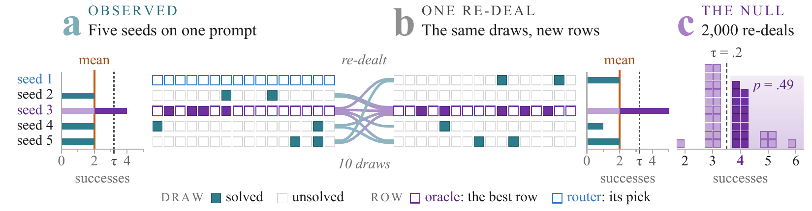
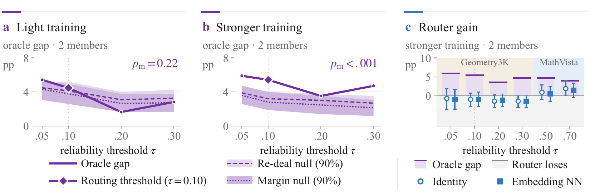

<div align="center">

# Oracle Gaps in Reliability Coverage

### Sampling Noise or Policy Specialization?

**Mert Onur Cakiroglu**<sup>1</sup> · **Mehmet Dalkilic**<sup>1</sup> · **Hasan Kurban**<sup>2</sup>

<sup>1</sup>Indiana University Bloomington &emsp; <sup>2</sup>Hamad Bin Khalifa University

[](https://arxiv.org/abs/2609.32996)
[](environment.yml)
[](environment.yml)
[](environment.yml)
[](environment.yml)
[](LICENSE)

</div>

<p align="center">
  
</p>

Policies trained from the same base model can appear to solve different problems. An oracle that picks the best policy for each prompt then looks much stronger than any single policy. Part of this *oracle gap* is a winner's curse. Picking the largest estimated success rate also picks favorable sampling errors.

This is the official code for the [paper](https://arxiv.org/abs/2609.32996). It implements two permutation tests that measure how much of an oracle gap sampling noise explains. They use only stored responses, so they can run before any router is trained.

- **Re-deal null.** Pools each prompt's stored correct and incorrect responses across policies and deals them out again.
- **Margin-preserving null.** Also keeps each policy's total number of correct responses fixed, so overall quality differences do not count as specialization.

The paper applies both tests to vision–language policies trained with GRPO (Qwen2.5-VL on Geometry3K and MathVista). It also compares routers, mixtures, voting, and weight averaging against the best single policy.

## Key findings

- For five training seeds of Qwen2.5-VL-7B-Instruct, the re-deal null reproduces 0.096 of an estimated 0.113 oracle gap at reliability threshold 0.10. Neither test finds significant evidence at this threshold. Small advantages remain unresolved.
- Mixtures, routers, voting, and weight averaging show no detectable improvement over their single-policy baselines.
- Under light post-training, policies trained on different datasets show little detectable specialization and no router gain. A stronger recipe does create specialization. Both tests detect it, and routers gain only at the high thresholds where the specialists separate.
- In a control with predictable specialization, a router recovers about half of the oracle gap.

<p align="center">
  
</p>

## Installation

```bash
git clone https://github.com/KurbanIntelligenceLab/oracle-gaps.git
cd oracle-gaps
conda env create -f environment.yml
conda activate oracle-gaps
```

The pinned versions are the ones used for the paper. The two tests need only NumPy.

## Quick start: test your own policies

The tests take one binary array `V` of shape `(prompts, policies, responses)`. `V[i, m, j]` is 1 if response `j` of policy `m` to prompt `i` is correct.

```python
import sys
sys.path.insert(0, "lib")

import numpy as np
from nulls_extra import both_nulls

V = np.load("my_verdicts.npy")  # shape (prompts, policies, responses)
res = both_nulls(V, k=V.shape[2], rng=np.random.default_rng(0), n_perm=2000, taus=(0.10,))

print(res[0.10]["L"]["redeal"])  # observed gap, null mean, 90% null band, p-value, excess
print(res[0.10]["L"]["margin"])  # the same under the margin-preserving null
```

`L` is the oracle gap: the oracle's coverage minus the best single policy's coverage. Coverage is the fraction of prompts whose success rate reaches the threshold. Each result also reports `D`, the fraction of prompts on which the policies disagree about reaching the threshold, and `gap`, the oracle's advantage over a uniform mixture.

`examples/quickstart.py` runs both tests on five simulated policies that are identical by construction:

```text
$ python examples/quickstart.py
redeal  oracle gap 0.137  null mean 0.141  excess -0.004  p = 0.697
margin  oracle gap 0.137  null mean 0.140  excess -0.003  p = 0.672
```

A 0.137 oracle gap appears although no policy is better on any prompt. Both nulls reproduce it, so it is sampling noise.

The command line also runs the planted-specialization power curve and the split-half estimates:

```bash
python lib/nulls_extra.py --name my_pool --verdicts my_verdicts.npz
```

`my_verdicts.npz` holds `verdicts` (the array above) and `prompt_ids`. Results go to `analysis/nulls_extra/my_pool.json`. For 240 prompts, 5 policies, and 16 responses, the run takes about three minutes on one CPU core.

## Reproducing the paper

The full pipeline trains and samples 7B and 3B vision–language policies. Each training or sampling job runs on one GPU with at least 32 GB of memory. All analyses run on a CPU.

Every script runs as one task of an array job and reads its settings from environment variables:

| Variable | Meaning |
|---|---|
| `DATA_DIR` | Storage for models, datasets, adapters, and sampled responses |
| `ITEM` | The task's work item, such as a seed or a prompt slice |
| `OUT` | Where the task writes its one-line result record |
| `TASK_ID` | The task's index in the array |

Run all commands from the repository root.

**1. Download models and datasets.** `data_prep/assets.txt` lists them. Each download records its pinned revision.

```bash
export DATA_DIR=/path/to/storage
while read -r asset; do ITEM="$asset" python data_prep/fetch_asset.py; done < data_prep/assets.txt
```

**2. Build splits and fix the reliability bands.** `data_prep/` builds hashed train, validation, and test splits. It also fixes each dataset's reliability band from base-model validation responses and applies the MathVista selection rule, which was fixed before any test scoring.

**3. Train and sample.** `training_and_sampling/jobs/` holds the exact run settings.

```bash
ITEM=1 bash training_and_sampling/jobs/train.sh                              # light recipe, seed 1, Geometry3K
ITEM="geometry3k|1" bash training_and_sampling/jobs/train_stronger.sh         # stronger recipe
ITEM="seed1|geometry3k|test|0|60" bash training_and_sampling/jobs/sample.sh   # 16 responses on 60 test prompts
```

| Variant | Setting |
|---|---|
| MathVista seeds | `CSM_DATASET=mathvista` for `train.sh` |
| 3B backbone | `CSM_MODEL_PATH=$DATA_DIR/CSM/models/Qwen2.5-VL-3B-Instruct CSM_RUN_TAG=_b3_lr1e5` for `train.sh` and `sample.sh` |
| 64 responses | `CSM_K=64 CSM_SEED=1` for `sample.sh` |
| 361 new prompts | `CSM_SEED=2` for `sample.sh` |
| Cross-dataset scoring | `sample_cross_dataset.sh` (light) and `sample_stronger.sh` (stronger) |

**4. Score and assemble.** `postprocess/` merges the sampled shards into a stored-response cache, re-scores every response with the corrected checker, and builds the analysis inputs in `data/`.

**5. Analyze and plot.** Each script in `analysis/` produces one group of results. Figures are written to `figures/out/`.

| Result | Code |
|---|---|
| Figure 1 | `figures/make_fig0.py` |
| Figure 2 | `figures/make_fig_training.py` |
| Table 1, oracle-gap tests | `lib/nulls_extra.py`, `analysis/nulls/reshuffle_null.py` |
| Table 2 and Tables A3–A4, simulations | `analysis/simulations/` |
| Table 3, selection and mixing | `analysis/deployment/` |
| Tables A1 and A5, routing and positive controls | `analysis/routing/` |
| Table A2, concentrated specialization | `lib/nulls_extra.py` |
| Table A6, both nulls on every evaluation set | `analysis/nulls/` |
| Tables A7–A9, cross-dataset pools | `analysis/cross_dataset/` |
| Table A10, voting | `analysis/voting/` |
| Table A11, MathVista selection | `data_prep/` |
| Table A12, replications | `analysis/replications/` |
| In-text diagnostics | `analysis/diagnostics/` |
| Appendix G, checker correction | `postprocess/rescore.py`, `postprocess/verifier_impact.py` |

## Repository structure

```text
oracle-gaps/
├── lib/                     shared modules: checker, coverage metrics, both nulls, routers, splits
├── data_prep/               downloads, prompt splits, band and dataset selection
├── training_and_sampling/   GRPO training, response sampling, prompt embeddings, weight averaging
│   └── jobs/                exact run settings for both recipes and every sampling run
├── postprocess/             scoring, re-scoring, analysis inputs
├── analysis/
│   ├── nulls/               both tests on every evaluation set, false-positive rates
│   ├── simulations/         excess versus the population gap, power, link sensitivity
│   ├── deployment/          best member, oracle, budget-matched mixture, weight averaging
│   ├── routing/             text and embedding routers, positive controls
│   ├── cross_dataset/       pools trained on different datasets, both recipes
│   ├── voting/              pooled and single-policy majority votes
│   ├── diagnostics/         seed similarity, coupled draws, multiple testing, token budget
│   └── replications/        64 responses, 361 new prompts, 3B backbone
├── figures/                 Figures 1 and 2
└── examples/                both tests on simulated policies
```

## Citation

```bibtex
@misc{cakiroglu2026oraclegapsreliabilitycoverage,
      title={Oracle Gaps in Reliability Coverage: Sampling Noise or Policy Specialization?}, 
      author={Mert Onur Cakiroglu and Mehmet Dalkilic and Hasan Kurban},
      year={2026},
      eprint={2609.32996},
      archivePrefix={arXiv},
      primaryClass={cs.CV},
      url={https://arxiv.org/abs/2609.32996}, 
}
```

## License

The code is released under the [MIT License](LICENSE). The models and datasets it downloads (Qwen2.5-VL, Geometry3K, MathVista, and MathVerse) keep their own licenses.
